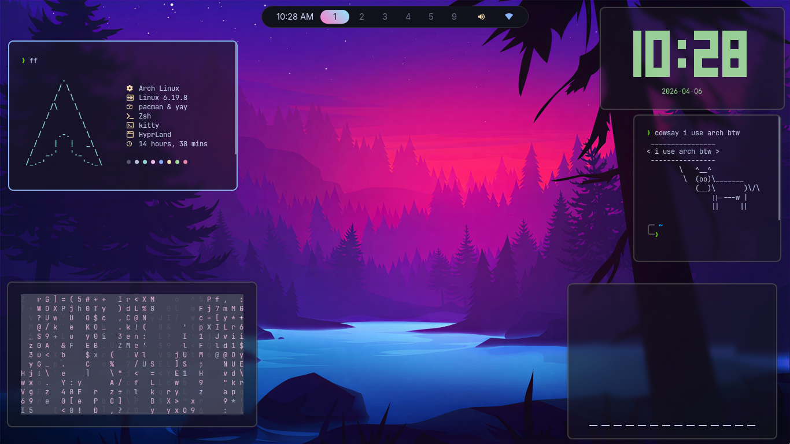

# 🌌 Archy-HYPE

Clean purple-themed Hyprland rice with glass UI and minimal layout.

---

## 📸 Screenshot



---

## 🎨 Features

* 🪟 WM: Hyprland
* 🖥️ Terminal: Kitty
* ⚡ Fetch: Fastfetch
* 🎵 Audio Visualizer: Cava
* 📊 Bar: Waybar
* 🎭 Theme: Purple glassmorphism

---

## 📦 Included Configs

* `hypr/` → Hyprland configs
* `kitty/` → Terminal theme
* `cava/` → Audio visualizer
* `fastfetch/` → System info
* `waybar/` → Top bar
* `wallpapers/` → Background

---

## ⚙️ Installation

```bash
git clone https://github.com/BelalAzabEl-Zoghby/Archy-HYPE.git
cd Archy-HYPE
cp -r * ~/.config/
```

---

## ⚠️ Notes

* Designed for 1920x1080 (may need tweaks)
* Edit `monitors.conf` for your screen
* You Should Have Omarchy Theme Installed For Some Commands And Shourtcuts And The Programs Before Installing This Theme
* Make sure required packages are installed:

  * hyprland
  * kitty
  * waybar
  * cava
  * fastfetch

---

## ❤️ Credits

Made by Belal Azab El-Zoghby

